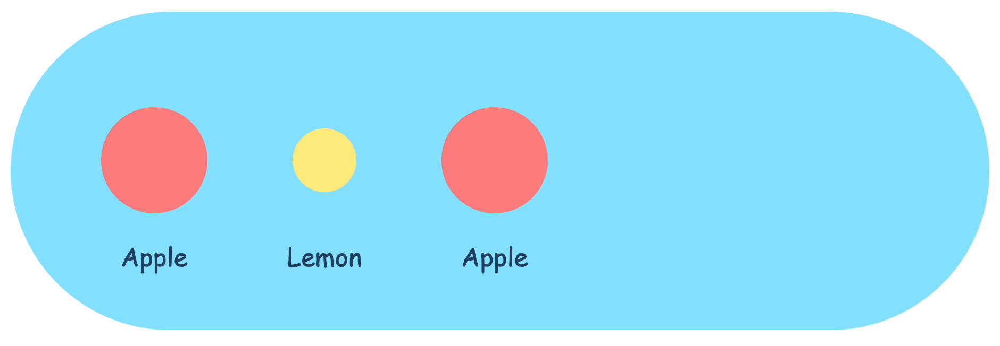

# The General Update Pattern of D3.js
Follow the video tutorial on FreeCodeCamp.org made by Curran Kelleher: https://www.youtube.com/watch?v=_8V5o2UHG0E&t=18276s

Source Code by: https://vizhub.com/curran/7f4137a77b564607ae2791ab1e49cf7e

This repository used [rollup.js](https://rollupjs.org/) as the JavaScript module bundler. 

## Demo of this repo 


## View the outcome
Open `public/index.html` in modern browser such as Chrome or Firefox directly. 

## Further development
To further develop the project by updating JavaScript, can run

```javascript

npm run bulid

```

or **watch** changes and auto compile:
```javascript
npm run watch
```